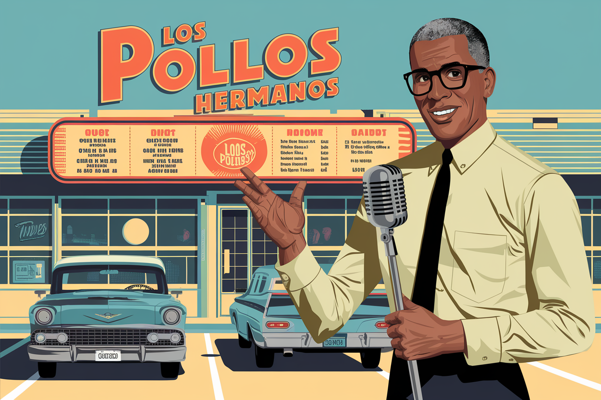

[](https://fastapi.tiangolo.com)
[](https://openai.com)
[](https://developer.mozilla.org/en-US/docs/Web/JavaScript)

# Los Pollos Hermanos AI Drive-Thru System

> **Disclaimer**: This project is a fan tribute based on the fictional restaurant from Breaking Bad. We are not affiliated with AMC, Breaking Bad, or any related entities. This is purely an educational project using a beloved fictional setting as our example case as part of the Large Language Model Agents MOOC, Fall 2024 held at Berkeley in California.

An intelligent drive-thru multilingual system powered by AI agents to enhance customer experience at Los Pollos Hermanos restaurants.

<div align="center">
  
</div>

## Features

- Natural language order processing
- Real-time order customization
- Multi-language support
- Intelligent upselling recommendations
- Queue optimization
- Voice recognition and synthesis

## Tech Stack

- Frontend: Vanilla JavaScript
- Backend: Python/FastAPI
- AI Models: OpenAI Real-time API
- WebSockets for real-time communication

## Environment Variables

```
WS_URL="wss://api.openai.com/v1/realtime"
MODEL="gpt-4o-realtime-preview-2024-10-01"
OPENAI_API_KEY=your_api_key
```

## Installation

1. Clone repository
2. Install dependencies:
```bash
pip install fastapi uvicorn python-dotenv websockets sounddevice numpy
```
3. Configure environment variables
4. Run system: `uvicorn main:app --reload`

See LICENSE file for terms and conditions.
